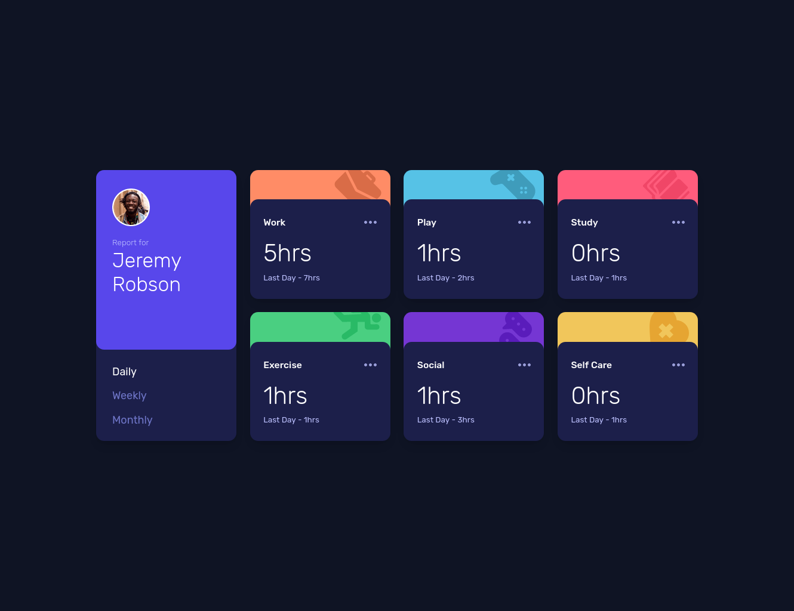

# Frontend Mentor - Time tracking dashboard solution

This is a solution to the [Time tracking dashboard challenge on Frontend Mentor](https://www.frontendmentor.io/challenges/time-tracking-dashboard-UIQ7167Jw). Frontend Mentor challenges help you improve your coding skills by building realistic projects.

## Table of contents

- [Frontend Mentor - Time tracking dashboard solution](#frontend-mentor---time-tracking-dashboard-solution)
  - [Table of contents](#table-of-contents)
  - [Overview](#overview)
    - [The challenge](#the-challenge)
    - [Screenshot](#screenshot)
    - [Links](#links)
  - [My process](#my-process)
    - [Built with](#built-with)
    - [What I learned](#what-i-learned)
    - [Continued development](#continued-development)
    - [Useful resources](#useful-resources)
  - [Author](#author)

## Overview

### The challenge

Users should be able to:

-   View the optimal layout for the site depending on their device's screen size
-   See hover states for all interactive elements on the page
-   Switch between viewing Daily, Weekly, and Monthly stats

### Screenshot

### Links

<!-- - Solution URL: [Add solution URL here](https://your-solution-url.com) -->

-   [Go to Demo](https://fm-time-tracking-dashboard-lau-san.vercel.app/)

## My process

### Built with

-   Flexbox
-   CSS Grid
-   Mobile-first workflow
-   [Tailwind CSS](https://tailwindcss.com/)
-   [React](https://reactjs.org/)

### What I learned

This is my first React project so I gained some valuable experience on that.

I also learned how to use Tailwind CSS.

### Continued development

This time I used `create-react-app` but I've heard that it's not the best way to do things, so in the future I'll look into other alternatives like Vite.

### Useful resources

-   [Tailwind CSS Docs](https://tailwindcss.com/docs) - I learned all I needed from the official Tailwind CSS Documentation

## Author

-   Frontend Mentor - [@Lau-San](https://www.frontendmentor.io/profile/Lau-San)
